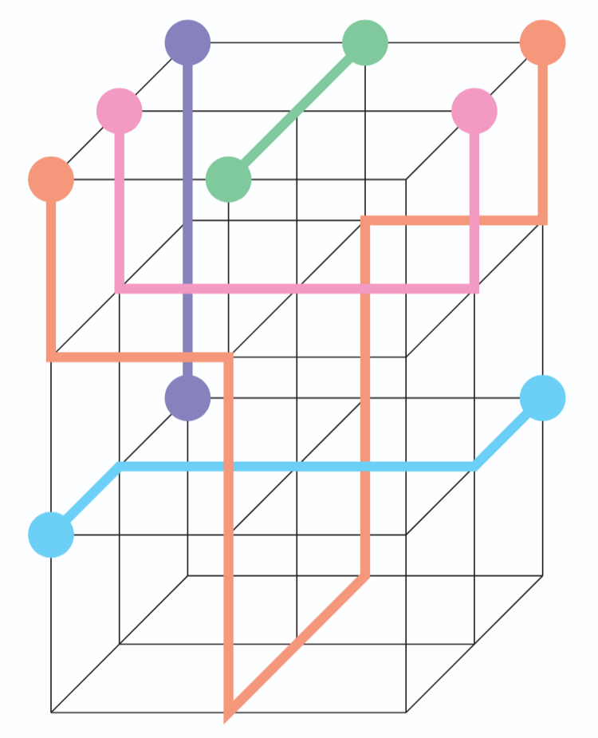

# 04 - Steiner Tree Packing Problem

**Application Area:** VLSI Design / Wire Routing

[← Back to Main Repository](../README.md)

---

## Overview

The Steiner Tree Packing Problem arises in VLSI design and wire routing, where multiple connection requirements must be satisfied simultaneously without conflicts. This variant is particularly relevant for modern chip design with multiple routing layers.

  

## Problem Description

Find a packing of node-disjoint Steiner trees with given terminals in a graph.

**Problem Variant Specifications:**
- **Geometry:** Switchbox problem on a square grid (terminals on edges)
- **Multi-layer:** Multiple square grids stacked vertically
- **Holes:** Some parallelepiped sections of the 3D graph are removed
- **Disjointness:** Each Steiner tree must use disjoint nodes

**Goal:** Connect all specified terminal sets using Steiner trees such that no two trees share vertices, minimizing total cost or maximizing the number of successfully routed nets.

## Directory Contents

- **[instances/](instances/)** - VLSI routing problem instances
- **[models/](models/)** - Mathematical model formulations
- **[solutions/](solutions/)** - Optimal or best-known solutions
- **[check/](check/)** - Solution verification tools
- **[info/](info/)** - Additional documentation and papers
- **[misc/](misc/)** - Utility scripts and generators

## References

* **Hoang, N.-D., Koch, T.** (2012). [Steiner Tree Packing Revisited](https://link.springer.com/article/10.1007/s00186-012-0391-8). Mathematical Methods of Operations Research, 76:95-123. ZIB Report 12-12.

Additional references are available in the [info/](info/) directory.
