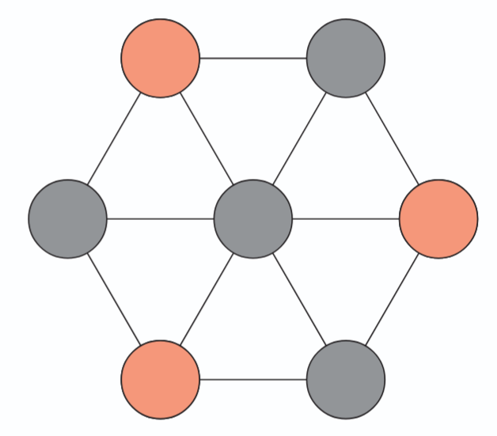

# 07 - Maximum Independent Set Problem

**Alternative Names:** Maximum Stable Set Problem, MISP

[← Back to Main Repository](../README.md)

---

## Overview

The Maximum Independent Set Problem is a fundamental graph optimization problem with applications in scheduling, resource allocation, and network design. Despite its simple formulation, it is NP-hard and challenging even for moderately-sized graphs.

  

## Problem Description

Given a graph $G=(V,E)$, find an independent set $I \subseteq V$ of maximum cardinality.

**Definition:** A set $I \subseteq V$ is *independent* (or *stable*) if no two vertices in $I$ are adjacent, i.e., there does not exist an edge $(u,v) \in E$ with $u, v \in I$.

**Objective:** Maximize $|I|$.

## Directory Contents

- **[instances/](instances/)** - Graph instances in various formats
- **[models/](models/)** - Mathematical model formulations
- **[solutions/](solutions/)** - Optimal or best-known solutions
- **[check/](check/)** - Solution verification tools
- **[misc/](misc/)** - Utility scripts and generators
- **[submissions/](submissions/)** - Community solution submissions

## Related Works

- **Parekh et al.** - [Benchmarking Adiabatic Quantum Optimization for Complex Network Analysis](https://arxiv.org/abs/1604.00319) - D-Wave experiments on Chimera graphs
- **Morita & Nishimori** - [Mathematical Foundation of Quantum Annealing](https://arxiv.org/abs/0806.1859)
- **Gaar, Siebenhofer, Wiegele** - [An SDP-based approach for computing the stability number of a graph](https://link.springer.com/article/10.1007/s00186-022-00773-1) - D-Wave 2X experiments on random graphs
- **Povh & Pucher** - [Advancing stable set problem solutions through quantum annealers](https://arxiv.org/abs/2308.13041) - QUBO formulation on D-Wave
- **Krpan, Povh, Pucher** - [Quantum computing and the stable set problem](https://arxiv.org/pdf/2405.12845) - QUBO with post-processing and partitioning methods
- **Chapuis et al.** - [Finding Maximum Cliques on the D-Wave Quantum Annealer](https://arxiv.org/abs/1801.08649) - Comparison with classical algorithms

## References

* **Xiao, M., Nagamochi, H.** (2013). [Exact Algorithms for Maximum Independent Set](https://link.springer.com/chapter/10.1007/978-3-642-45030-3_31). In: Cai, L., Cheng, S.W., Lam, T.W. (eds) Algorithms and Computation. ISAAC 2013. Lecture Notes in Computer Science, vol 8283. Springer, Berlin, Heidelberg.

* **Hoang, D.A.** (2023). [On the Complexity of Distance-d Independent Set Reconfiguration](https://link.springer.com/chapter/10.1007/978-3-031-27051-2_22). In: Lin, C.C., Lin, B.M.T., Liotta, G. (eds) WALCOM: Algorithms and Computation. WALCOM 2023. Lecture Notes in Computer Science, vol 13973. 
