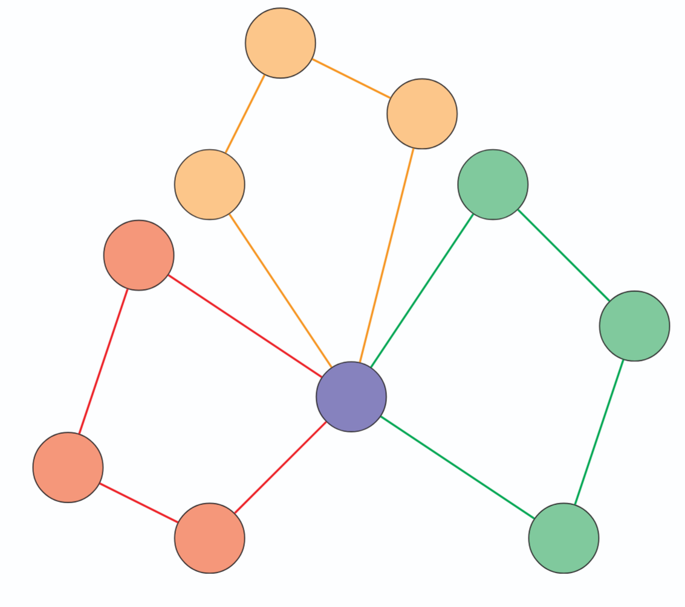

# 09 - Vehicle Routing Problem

**Variant:** VRP with Time Windows and Capacity Constraints (TSP + Time Window + Knapsack)

[← Back to Main Repository](../README.md)

---

## Overview

The Vehicle Routing Problem (VRP) is a classic logistics optimization problem combining aspects of the Traveling Salesman Problem, time window scheduling, and knapsack constraints. It has direct applications in delivery services, supply chain management, and transportation planning.

  

## Problem Description

Given:
- A fleet of $k$ vehicles, each with capacity $X$
- A central depot
- A set of customers $C = \{1,\ldots,n\}$ with demands $d_i$ for $i \in C$
- Time windows for each customer
- Distance/cost matrix between all locations

**Objective:** Determine routes for all vehicles to serve all customers while:
- Respecting vehicle capacity constraints
- Satisfying time window requirements
- Minimizing total distance or cost

**Instance Parameters:**
- $k = 4$ vehicles
- $n = 20$ customers

## Directory Contents

- **[instances/](instances/)** - VRP problem instances
- **[models/](models/)** - Mathematical model formulations
- **[solutions/](solutions/)** - Optimal or best-known solutions
- **[misc/](misc/)** - Utility scripts and visualization tools

## References

* **Sun, B., et al.** (2021). [Competitive algorithms for the online multiple knapsack problem with application to electric vehicle charging](https://doi.org/10.1145/3428336). Proc. ACM Meas. Anal. Comput. Syst. 4.

* **Sun, B., et al.** (2022). [The online knapsack problem with departures](https://doi.org/10.1145/3570618). Proc. ACM Meas. Anal. Comput. Syst. 6.

* **Federer, M., et al.** (2022). [Application benchmark for quantum optimization on electro-mobility use case](https://ieeexplore.ieee.org/document/10003292). In 2022 IEEE Vehicle Power and Propulsion Conference (VPPC), pp. 1–6.
