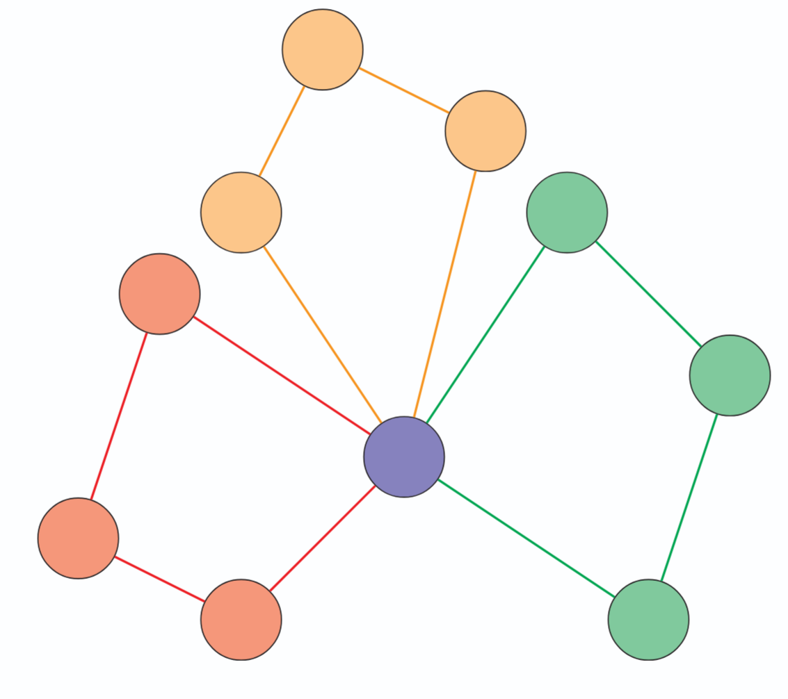

# 09 - Vehicle Routing Problem

**Variant:** VRP with Time Windows and Capacity Constraints (TSP + Time Window + Knapsack)

[← Back to Main Repository](../README.md)

---

## Overview

The Vehicle Routing Problem (VRP) is a classic logistics optimization problem combining aspects of the Traveling Salesman Problem, time window scheduling, and knapsack constraints. It has direct applications in delivery services, supply chain management, and transportation planning.

<p align="center">
  
</p>

## Problem Description

Given:
- A fleet of $k$ vehicles, each with capacity $X$
- A central depot
- A set of customers $C = \{1,\ldots,n\}$ with demands $d_i$ for $i \in C$
- Time windows for each customer
- Distance/cost matrix between all locations

**Objective:** Determine routes for all vehicles to serve all customers while:
- Respecting vehicle capacity constraints
- Satisfying time window requirements
- Minimizing total distance or cost

**Instance Parameters:**
- $k = 4$ vehicles
- $n = 20$ customers

## Directory Contents

- **[instances/](instances/)** - VRP problem instances
- **[models/](models/)** - Mathematical model formulations
- **[solutions/](solutions/)** - Optimal or best-known solutions
- **[misc/](misc/)** - Utility scripts and visualization tools

## Solution Approaches

### Graph-Based Genetic Algorithm via Giant-Tour Decomposition

**Author:** Othmane El Yaakoubi &nbsp;·&nbsp; **Code:** [github.com/othma125/heuristicCVRP](https://github.com/othma125/heuristicCVRP) &nbsp;·&nbsp; **Submission:** [`submissions/20260708_MemeticGA_ElYaakoubi/`](submissions/20260708_MemeticGA_ElYaakoubi/)

A CVRP-native hybrid of a Genetic Algorithm and graph-theoretic optimization. Rather than searching over route-level encodings with cut-point crossover, it evolves **giant tours** (permutations of all customers, no route delimiters) and delegates feasibility and route construction to a graph:

- **Giant-tour representation & global search.** The GA explores customer sequencing via selection and mutation on permutations, keeping the search unconstrained by capacity during evolution. Fitness is never evaluated on the tour directly — each individual is decoded into a feasible solution by the graph.
- **Graph-based splitting.** For each giant tour a directed acyclic graph is built where an arc `i → j` represents a capacity-feasible route covering the customers between positions `i+1` and `j`, weighted by its exact routing cost (including depot connections). The optimal split into routes reduces to a **shortest-path problem** on this graph, giving a capacity-feasible, cost-optimal partition for that tour.
- **Embedded local search.** Intra-route moves (e.g. 2-opt, segment reversal) and inter-route moves (alternative split points, customer reallocation) are evaluated *inside* the graph via competing arcs, so shortest-path selection picks improved routes without a separate improvement phase.
- **Graph-based crossover.** Instead of exchanging contiguous segments, a combined graph is built from arcs of both parents (each tagged by origin); the shortest path assembles the offspring from the best-performing, possibly non-contiguous fragments of each parent — *recombination through optimization*, with feasibility guaranteed by construction.
- **Parallelism.** Arc feasibility/cost computation, local-search evaluation, and per-individual decoding are multi-threaded (Java), scaling on multi-core hardware.

#### Stopping criterion (adaptive stagnation)

The search has **no fixed iteration or time budget** and **no known-optimum cutoff** — the best-known value is read only *after* solving, purely to report the gap. Each generation the main loop continues if *either* the generation improved the incumbent *or* an adaptive stagnation rule votes to keep going:

```
while ( runCrossovers() || nonStopCondition() ) { }
```

Let `stagnation = now − lastImprovementTime` and `elapsed = now − startTime`. The rule is:

1. **Grace window** — while `stagnation ≤ StagnationMinTime`, always continue (no random draw). Every new incumbent resets `lastImprovementTime`, so each improvement buys a fresh grace window.
2. **Probabilistic decay** — past the grace window, continue with probability `1 − p`, where `p = (stagnation − StagnationMinTime) / elapsed`. The longer the search stalls without a new best, the larger `p`, so termination becomes increasingly likely.

`StagnationMinTime = max(100, 100·√n)` ms scales the grace window with instance size (≈ 447 ms for `n = 20`); population size is `max(20, 10·log₁₀ n)`.

**Consequence for reported times.** Because the algorithm cannot detect that it has hit the optimum, the **time-to-solution** (timestamp of the last incumbent improvement) is strictly earlier than the **total runtime**: after the best solution is found, the run still spends the grace window plus the probabilistic tail before terminating. That difference *is* the stopping machinery winding down — using the known optimum as a cutoff would collapse the two.

Both quantities are **stochastic**: the whole search (random initial population, randomized selection and crossover) *and* the probabilistic stopping rule are seeded from `ThreadLocalRandom`, so TTS and total runtime vary from run to run for the same instance — they are not deterministic properties of the instance. This is why the submission reports them over multiple runs rather than as single fixed numbers.

## References

* **Sun, B., et al.** (2021). [Competitive algorithms for the online multiple knapsack problem with application to electric vehicle charging](https://doi.org/10.1145/3428336). Proc. ACM Meas. Anal. Comput. Syst. 4.

* **Sun, B., et al.** (2022). [The online knapsack problem with departures](https://doi.org/10.1145/3570618). Proc. ACM Meas. Anal. Comput. Syst. 6.

* **Federer, M., et al.** (2022). [Application benchmark for quantum optimization on electro-mobility use case](https://ieeexplore.ieee.org/document/10003292). In 2022 IEEE Vehicle Power and Propulsion Conference (VPPC), pp. 1–6.
