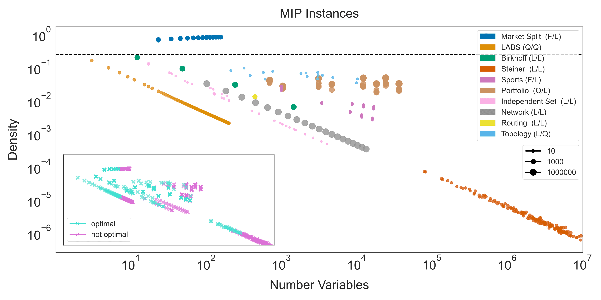
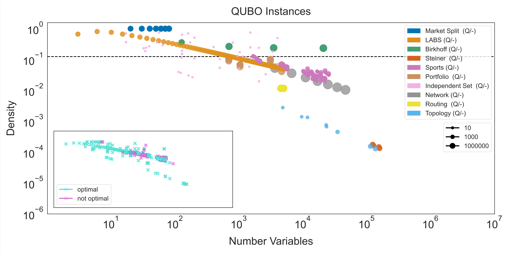

# Quantum Optimization Benchmarking Library (QOBLIB)

A comprehensive benchmark suite for quantum optimization methods, featuring ten challenging problem classes with practical applications.

[](https://arxiv.org/pdf/2504.03832)
[](LICENSE)
[](LICENSE.data)

## Description 

With the aim of enabling fair, comparable, and meaningful benchmarks for quantum optimization methods, we here present ten optimization problem classes that are difficult for existing classical algorithms and can (mostly) be linked to practically-relevant applications.
While the individual properties of the problem classes vary in terms of objective and variable type, coefficient ranges, and density, they all become challenging for established classical methods already at system sizes in the range of about 100 to 10 000 decision variables.
This repository holds problem instances of varying complexity, exemplary model descriptions, solution track records, and references or explicit functionality for checking solution feasibility.

## Table of Contents

- [Quantum Optimization Benchmarking Library (QOBLIB)](#quantum-optimization-benchmarking-library-qoblib)
  - [Description](#description)
  - [Table of Contents](#table-of-contents)
  - [Overview](#overview)
  - [Paper Reference](#paper-reference)
  - [Problem Complexity Landscape](#problem-complexity-landscape)
  - [Problem Classes](#problem-classes)
  - [Repository Structure](#repository-structure)
    - [Folder Descriptions](#folder-descriptions)
  - [Getting Started](#getting-started)
    - [Exploring Problem Instances](#exploring-problem-instances)
    - [Verifying Solutions](#verifying-solutions)
    - [Submitting Solutions](#submitting-solutions)
  - [Best Practices](#best-practices)
    - [Solution Reporting](#solution-reporting)
    - [Hardware Implementation](#hardware-implementation)
  - [Contributors and Acknowledgment](#contributors-and-acknowledgment)
    - [Core Contributors](#core-contributors)
  - [License](#license)
  - [Citation](#citation)
  - [Contact](#contact)

## Overview

QOBLIB enables **fair, comparable, and meaningful benchmarks** for quantum optimization methods by providing:

- **10 optimization problem classes** difficult for classical algorithms yet tied to practical applications
- **Problem instances** of varying complexity (100 to 10,000 decision variables)
- **Model descriptions** in standard formats
- **Solution track records** with optimal/best-known solutions
- **Verification tools** to check solution feasibility

The problem classes vary in objective type, variable type, coefficient ranges, and density, all becoming challenging for established classical methods at moderate system sizes.

## Paper Reference

**[Quantum Optimization Benchmark Library: The Intractable Decathlon](https://arxiv.org/pdf/2504.03832)**

## Problem Complexity Landscape

The plots below illustrate the computational difficulty of our problem instances across different formulations. Both MIP and QUBO formulations show how the instances become increasingly challenging with growing problem size and density, making them ideal benchmarks for emerging quantum optimization methods.


*Mixed Integer Programming Formulations*


*QUBO Formulations*

## Problem Classes

| #   | Problem Class                      | Description                                         | Link                         |
| --- | ---------------------------------- | --------------------------------------------------- | ---------------------------- |
| 01  | **Market Split**                   | Multi-dimensional Subset Sum                        | [Details](01-marketsplit)    |
| 02  | **LABS**                           | Low Autocorrelation Binary Sequences                | [Details](02-labs)           |
| 03  | **Minimum Birkhoff Decomposition** | Doubly Stochastic Matrix Decomposition              | [Details](03-birkhoff)       |
| 04  | **Steiner Tree Packing**           | VLSI Design / Wire Routing                          | [Details](04-steiner)        |
| 05  | **Sports Tournament Scheduling**   | Constraint Satisfaction Problem                     | [Details](05-sports)         |
| 06  | **Portfolio Optimization**         | Multi-period with Transaction Costs & Short Selling | [Details](06-portfolio)      |
| 07  | **Maximum Independent Set**        | Unweighted MIS                                      | [Details](07-independentset) |
| 08  | **Network Design**                 | Telecommunications Network Planning                 | [Details](08-network)        |
| 09  | **Vehicle Routing**                | VRP: TSP + Time Window + Knapsack                   | [Details](09-routing)        |
| 10  | **Topology Design**                | Graph Golf / Node-Degree-Diameter Problem           | [Details](10-topology)       |

## Repository Structure

Each problem class has its own directory with the following standardized structure:

```
XX-problemname/
├── check/          # Solution verification programs
├── info/           # Background materials and papers
├── instances/      # Problem instances in various formats
├── misc/           # Utility scripts and tools
├── models/         # Model descriptions (LP, QUBO, etc.)
├── solutions/      # Known optimal/best solutions
└── submissions/    # Community submissions
```

### Folder Descriptions

| Folder          | Purpose                                                 |
| --------------- | ------------------------------------------------------- |
| **check**       | Programs to verify solution correctness and feasibility |
| **info**        | Documentation, papers, and additional context           |
| **instances**   | Problem instances (format varies by problem class)      |
| **misc**        | Miscellaneous files, scripts, and generators            |
| **models**      | Mathematical model formulations                         |
| **solutions**   | Optimal or best-known solutions with objective values   |
| **submissions** | Community-contributed solutions and approaches          |

## Getting Started

### Exploring Problem Instances

1. Navigate to a problem class directory (e.g., `01-marketsplit/`)
2. Check the problem-specific README for instance format details
3. Browse available instances in the `instances/` folder
4. Review example solutions in the `solutions/` folder

### Verifying Solutions

Each problem class includes verification tools in the `check/` folder:

```bash
cd XX-problemname/check
# Follow instructions in the problem-specific README
```

### Submitting Solutions

See [CONTRIBUTING.md](./CONTRIBUTING.md) for detailed submission guidelines. 

## Best Practices

### Solution Reporting

For guidelines on submitting solutions and reporting results, please refer to the [contribution guidelines](./CONTRIBUTING.md).

### Hardware Implementation

A collection of guidelines for running quantum optimization algorithms with Qiskit on superconducting qubit hardware can be found in the [qopt-best-practices](https://github.com/qiskit-community/qopt-best-practices) repository.

## Contributors and Acknowledgment

This repository was created as part of the **Quantum Optimization Working Group** effort initiated in July 2023 by IBM Quantum and its partners.

### Core Contributors

**Thorsten Koch** (koch@zib.de), David E. Bernal Neira, Ying Chen, Giorgio Cortiana, Daniel J. Egger, Raoul Heese, Narendra N. Hegade, Alejandro Gomez Cadavid, Rhea Huang, Toshinari Itoko, Thomas Kleinert, Pedro Maciel Xavier, Naeimeh Mohseni, Jhon A. Montanez-Barrera, Koji Nakano, Giacomo Nannicini, Corey O'Meara, Justin Pauckert, Manuel Proissl, Anurag Ramesh, **Maximilian Schicker** (schicker@zib.de), Noriaki Shimada, Mitsuharu Takeori, Victor Valls, David Van Bulck, **Stefan Woerner** (WOR@zurich.ibm.com), and **Christa Zoufal** (OUF@zurich.ibm.com).

## License

This project uses **dual licensing**:

| Content Type | License                     | Description                         |
| ------------ | --------------------------- | ----------------------------------- |
| **Code**     | [Apache 2.0](./LICENSE)     | All scripts, programs, and software |
| **Data**     | [CC BY 4.0](./LICENSE.data) | Problem instances and raw data      |

**Third-party files**: For files not generated by us, please refer to individual file attributions. Appropriate credit must be given to the original providers as specified.

---

## Citation

If you use QOBLIB in your research, please cite:

```bibtex
@misc{
  koch2025quantumoptimizationbenchmarkinglibrary,
  title={Quantum Optimization Benchmarking Library - The Intractable Decathlon}, 
  author={Thorsten Koch and David E. Bernal Neira and Ying Chen and Giorgio Cortiana and Daniel J. Egger and Raoul Heese and Narendra N. Hegade and Alejandro Gomez Cadavid and Rhea Huang and Toshinari Itoko and Thomas Kleinert and Pedro Maciel Xavier and Naeimeh Mohseni and Jhon A. Montanez-Barrera and Koji Nakano and Giacomo Nannicini and Corey O'Meara and Justin Pauckert and Manuel Proissl and Anurag Ramesh and Maximilian Schicker and Noriaki Shimada and Mitsuharu Takeori and Victor Valls and David Van Bulck and Stefan Woerner and Christa Zoufal},
  year={2025},
  eprint={2504.03832},
  archivePrefix={arXiv},
  primaryClass={quant-ph},
  url={https://arxiv.org/abs/2504.03832}, 
}
```

## Contact

For questions, issues, or contributions, please open an issue on this repository or contact the maintainers listed in the contributors section.
